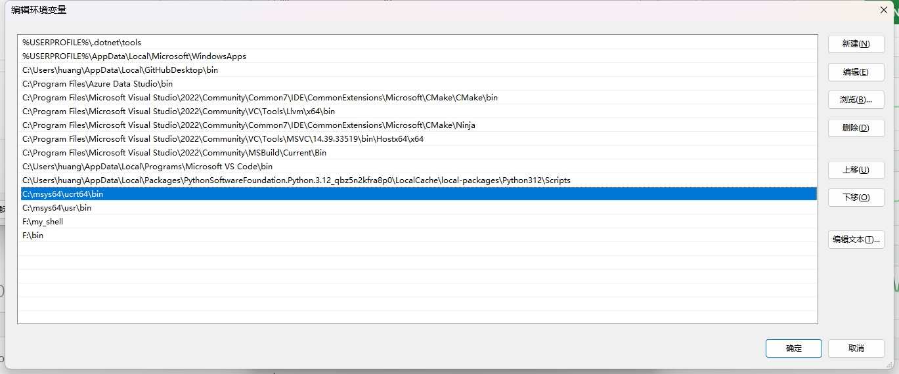
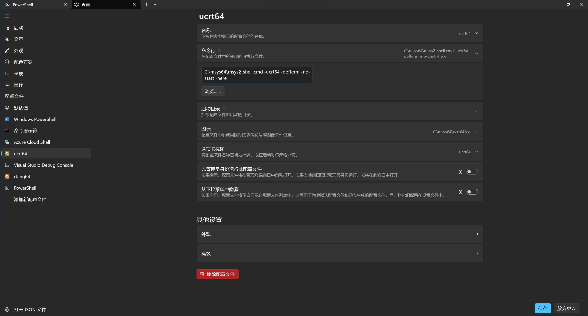

# 简介

一些常用的 C/C++ 库的自动化构建脚本。

# msys2 环境搭建

## 安装 msys2

[msys2 官网链接](https://www.msys2.org/)

下载安装后需要在环境变量 `Path` 中添加如下路径：

```powershell
C:\msys64\home\%USERNAME%\bin
C:\msys64\ucrt64\bin
C:\msys64\usr\bin
```

需要将这些路径移动到最下方，确保优先级最低，如下图所示



安装 msys2 后，在使用本项目的脚本来构建第三方库的时候可能还会缺一些工具，这时候需要用 pacman 命令安装。

## 安装 visual studio2022

安装时要选择 C++ 的桌面开发，并且要安装 clang 工具链。然后在环境变量 `Path` 中添加如下路径：

```powershell
C:\Program Files\Microsoft Visual Studio\2022\Community\Common7\IDE\CommonExtensions\Microsoft\CMake\CMake\bin
C:\Program Files\Microsoft Visual Studio\2022\Community\VC\Tools\Llvm\x64\bin
C:\Program Files\Microsoft Visual Studio\2022\Community\Common7\IDE\CommonExtensions\Microsoft\CMake\Ninja
C:\Program Files\Microsoft Visual Studio\2022\Community\MSBuild\Current\Bin
C:\Program Files\Microsoft Visual Studio\2022\Community\VC\Tools\MSVC\14.39.33519\bin\Hostx64\x64
```

## 卸载 msys2 中自带的 cmake

使用

```bash
pacman -R cmake
```

卸载 msys2 自带的 cmake

## 安装 python3

不要用 pacman 安装 python，如果已经装了，先卸载，然后下载 windows 的安装包进行安装。也可以用微软应用商店进行安装。在商店里搜索 python3。

## 部署 my_shell

克隆仓库：

```
https://github.com/hjc2000/my_shell.git
```

然后将这个脚本的目录添加到环境变量 `Path ` 中。

## 安装 powershell7

不要用 windows 自带的 powershell，这个版本比较旧。安装完后需要执行：

```powershell
Set-ExecutionPolicy -ExecutionPolicy Unrestricted -Scope CurrentUser
```

这样才能执行 ps1 脚本，否则会被以安全为理由阻止执行。

## 在 Windows 终端中使用 msys2 ucrt64

点击设置，添加配置文件，在 ”命令行“ 输入框中输入如下内容：

```cmd
C:\msys64\msys2_shell.cmd -ucrt64 -defterm -no-start -here
```

如图所示：



# linux 环境搭建

首先要安装 powershell7，可以参考微软的文档。其他软件在使用过程中逐渐安装就行了。缺啥补啥。
