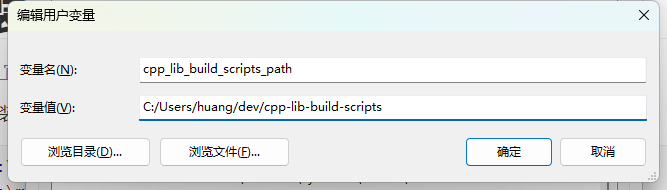

# 简介

一些常用的 C/C++ 库的自动化构建脚本。

# windows 环境搭建

## cpp_lib_build_scripts_path 环境变量

在环境变量中添加 `cpp_lib_build_scripts_path` ，指向本仓库的所在路径，如下图所示：



记得要把所有反斜杠 `\` 替换成正斜杠 `/` .

## 安装 msys2

[msys2 官网链接](https://www.msys2.org/)

下载安装后需要在环境变量 `Path` 中添加如下路径：

```powershell
C:\msys64\home\%USERNAME%\bin
C:\msys64\ucrt64\bin
C:\msys64\usr\bin
```

需要将这些路径移动到最下方，确保优先级最低，如下图所示


安装 msys2 后，在使用本项目的脚本来构建第三方库的时候可能还会缺一些工具，这时候需要用 pacman 命令安装。

## 安装 visual studio2022

安装时要选择 C++ 的桌面开发，并且要安装 clang 工具链。然后在环境变量 `Path` 中添加如下路径：

```powershell
C:\Program Files\Microsoft Visual Studio\2022\Community\Common7\IDE\CommonExtensions\Microsoft\CMake\CMake\bin
C:\Program Files\Microsoft Visual Studio\2022\Community\VC\Tools\Llvm\x64\bin
C:\Program Files\Microsoft Visual Studio\2022\Community\Common7\IDE\CommonExtensions\Microsoft\CMake\Ninja
C:\Program Files\Microsoft Visual Studio\2022\Community\MSBuild\Current\Bin
C:\Program Files\Microsoft Visual Studio\2022\Community\VC\Tools\MSVC\14.39.33519\bin\Hostx64\x64
```

## 安装 python3

不要用 pacman 安装 python，如果已经装了，先卸载，然后下载 windows 的安装包进行安装。也可以用微软应用商店进行安装。在商店里搜索 python3。

## 部署 my_shell

克隆仓库：

```
https://github.com/hjc2000/my_shell.git
```

然后将这个脚本的目录添加到环境变量 `Path ` 中。

## 安装 powershell 7

不要用 windows 自带的 powershell，这个版本比较旧。安装完后需要执行：

```powershell
Set-ExecutionPolicy -ExecutionPolicy Unrestricted -Scope CurrentUser
```

这样才能执行 ps1 脚本，否则会被以安全为理由阻止执行。

## 在 Windows 终端中使用 msys2 ucrt64

点击设置，添加配置文件，在 ”命令行“ 输入框中输入如下内容：

```cmd
pwsh -Command enter-bash.ps1
```

如图所示：


这里是利用 my_shell 中的一个 ps1 脚本来启动 ucrt64 环境下的 bash.

# linux 环境搭建

首先要安装 powershell7，可以参考微软的文档。其他软件在使用过程中逐渐安装就行了。缺啥补啥。

# arm-none-eabi-gnu 工具链下载

[下载链接](https://developer.arm.com/downloads/-/arm-gnu-toolchain-downloads)

下载完后放到

```
cpp-lib-build-scripts/.toolchain
```

然后更新各个平台的 `${平台}-setup.cmake$` 文件，例如

```cmake
# region 配置平台、工具链。

set(BUILD_SHARED_LIBS
	false
	CACHE STRING "是否编译动态链接库"
	FORCE)

set(CMAKE_SYSTEM_NAME
	"Generic"
	CACHE STRING "平台"
	FORCE)

set(tool_chain_root_path "$ENV{cpp_lib_build_scripts_path}/.toolchain/arm-none-eabi-14.2/bin")

set(CMAKE_C_COMPILER
	"${tool_chain_root_path}/arm-none-eabi-gcc.exe"
	CACHE STRING "平台"
	FORCE)

set(CMAKE_CXX_COMPILER
	"${tool_chain_root_path}/arm-none-eabi-g++.exe"
	CACHE STRING "平台"
	FORCE)

set(CMAKE_ASM_COMPILER
	"${tool_chain_root_path}/arm-none-eabi-gcc.exe"
	CACHE STRING "平台"
	FORCE)

set(CMAKE_LINKER
	"${tool_chain_root_path}/arm-none-eabi-ld.exe"
	CACHE STRING "平台"
	FORCE)

set(CMAKE_OBJCOPY
	"${tool_chain_root_path}/arm-none-eabi-objcopy.exe"
	CACHE STRING "平台"
	FORCE)

set(CMAKE_SIZE
	"${tool_chain_root_path}/arm-none-eabi-size.exe"
	CACHE STRING "平台"
	FORCE)

set(CMAKE_STRIP
	"${tool_chain_root_path}/arm-none-eabi-ld.exe"
	CACHE STRING "平台"
	FORCE)

# endregion


# 添加查找库的路径。
# cmake 会从 CMAKE_PREFIX_PATH 路径列表里面的路径查找库、包等。
list(PREPEND CMAKE_PREFIX_PATH ${total_install_path})
list(PREPEND CMAKE_PREFIX_PATH ${total_install_path}/lib)

set(CMAKE_FIND_ROOT_PATH ${total_install_path})
set(CMAKE_FIND_ROOT_PATH_MODE_PROGRAM NEVER)
set(CMAKE_FIND_ROOT_PATH_MODE_LIBRARY ONLY)
set(CMAKE_FIND_ROOT_PATH_MODE_INCLUDE ONLY)
set(CMAKE_FIND_ROOT_PATH_MODE_PACKAGE ONLY)

```

把第 13 行的工具链路径修改一下。
